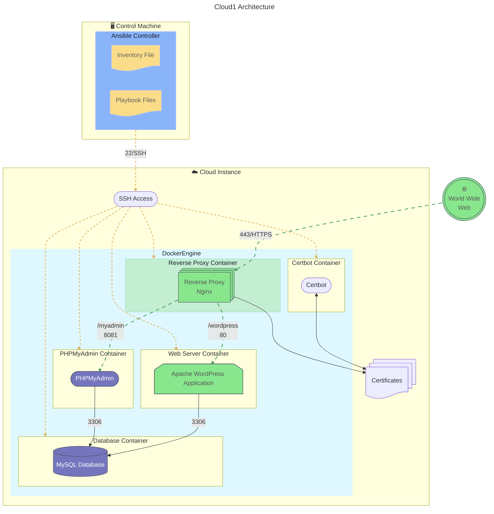
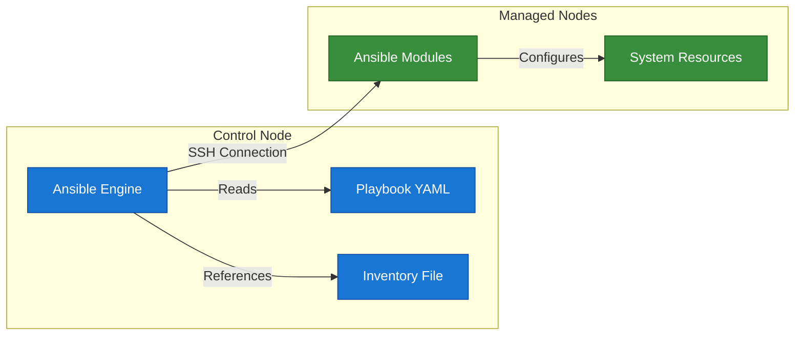
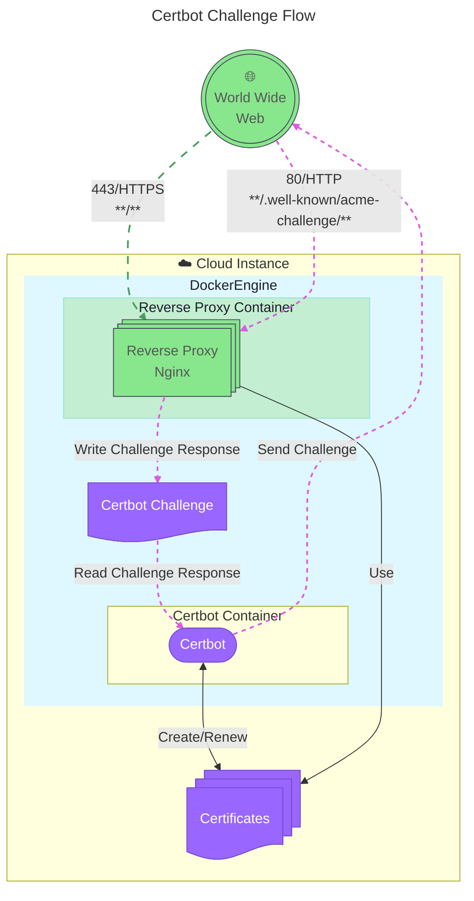

# Cloud1


Automated deployment of a WordPress website on a cloud instance.
This project uses **Ansible** to configure a cloud instance with Docker containers running **MySQL**, **PHPMyAdmin**, **Nginx**, and **WordPress**. It also includes automatic **SSL** certificate management using **Certbot**.
**Ansible vault** and **docker secrets** are used to secure sensitive information.

## Infrastructure

Each of this service will have it's container:

<ul>
  <li>
     MySQL
  </li>
  <li>
     PHPmyadmin
  </li>
  <li>
     Nginx
  </li>
  <li>
     WordPress
  </li>
</ul>

Technologies used in this project:

<ul>
  <li>
     Ansible
  </li>
  <li>
     Docker
  </li>
</ul>

## Architecture



## Setup

1. Clone the repository:

   ```bash
   git clone git@github.com:Tablerase/Cloud1.git
   cd Cloud1
   ```

2. Create a Python virtual environment (optional but recommended):

   ```bash
   python3 -m venv .venv
   source .venv/bin/activate
   ```

3. Install the required dependencies (Ansible):

   ```bash
   pip install -r requirements.txt
   ```

4. Configure your inventory file:

   ```bash
   cp inventory/inventory.example.yml inventory/inventory.yml
   ```

5. **Edit the `inventory/inventory.yml` file** to add your server details. Like for example:

   ```yaml
   all:
     hosts:
       wp1:
         ansible_host: your.server.instance.ip
         ansible_user: root
         ansible_ssh_private_key_file: ~/.ssh/id_rsa # or other key file
   ```

6. **Configure variables** by editing the `inventory/group_vars/all/all.yml` file.

   - For `project_domain`: use website like [DuckDNS](https://www.duckdns.org/domains) to get a free domain name. Just put the ip address of your server instance and choose a domain name.

7. **Configure vault** by creating a vault password file and creating a vault-encrypted file.

   ```bash
   echo "your_vault_password" > .vault_pass.txt
   ```

   Then, create a vault-encrypted file using the following command:

   ```bash
   ansible-vault create inventory/group_vars/all/vault.yml
   ```

   Then, edit the `inventory/group_vars/all/vault.yml` file to add your sensitive variables:

   ```yaml
   # This file will be encrypted with ansible-vault.
   # Define sensitive variables here and reference them from plain group_vars via vault_* variables.

   vault_mysql_root_password: your_mysql_root_password
   vault_mysql_password: your_mysql_password
   vault_wordpress_admin_password: your_wordpress_admin_password
   vault_wordpress_admin_email: your_wordpress_admin_email
   vault_certbot_email: your_certbot_email
   ```

   If needed, to decrypt the vault file, use the following command:

   ```bash
   ansible-vault decrypt inventory/group_vars/all/vault.yml
   ```

8. **Check your Ansible connection** by running the following command:

   ```bash
   ansible all -i inventory/inventory.yml -m ping
   ```

   - If the connection is successful, you should see a "pong" response from each host.
   - Otherwise, check your SSH configuration (like your SSH keys and config file), ensure that the Ansible user (from inventory) has the necessary permissions to connect to the remote server, and that the server is reachable.

9. **Deploy your WordPress site** by running the following command:

   ```bash
   ansible-playbook -i inventory/inventory.yml playbooks/site.yml
   ```

   If you need to pass any extra variables to the playbook, you can do so using the `-e` flag:

   ```bash
   ansible-playbook -i inventory/inventory.yml playbooks/site.yml -e "variable_name=value"
   ```

   If you need to use only certain roles from the playbook, you can specify them using the `--tags` flag:

   ```bash
   ansible-playbook -i inventory/inventory.yml playbooks/site.yml --tags "tag_name"
   ```


## Secrets and Ansible Vault

Sensitive values are defined in `inventory/group_vars/all/vault.yml` and referenced in `inventory/group_vars/all/all.yml` as `vault_*` variables. Keep `vault.yml` encrypted with Ansible Vault.

- `ansible.cfg` is set with `vault_identity_list = default@.vault_pass.txt` so a local `.vault_pass.txt` can unlock the vault automatically (this file is gitignored).
- Docker services use secrets with `_FILE` env vars; Ansible writes secret files to `{{ docker_compose_path }}/secrets` with `0600` permissions and `no_log: true`.

How to use:

1. Create `.vault_pass.txt` at the repo root containing your vault password (optional; otherwise pass `--ask-vault-pass`).
2. Encrypt or create the vault file:

- `ansible-vault encrypt inventory/group_vars/all/vault.yml` (if file exists)
- or `ansible-vault create inventory/group_vars/all/vault.yml`

3. Run the playbook: `ansible-playbook playbooks/site.yml`

To rotate secrets: `ansible-vault edit inventory/group_vars/all/vault.yml` and re-run the playbook.

## [Ansible](https://docs.ansible.com/)

Ansible is a powerful open-source automation tool that can be used to deploy and manage applications and services.



Ansible operates on a control node that manages one or more managed nodes. The control node runs the Ansible engine, which reads playbooks and inventories to execute tasks on the managed nodes.

### Key Components

- **Ansible Engine**: The core component that executes tasks defined in playbooks.
- **Playbooks**: YAML files that define the tasks to be executed on the managed nodes.
- **Inventory**: A file that lists the managed nodes and their connection details.
- **Ansible Modules**: Reusable scripts that perform specific tasks on the managed nodes.
- **Managed Nodes**: The servers or devices that Ansible manages.

### Inventory and Playbooks

Inventories allow you to define the managed nodes and their connection details. Ansible uses these inventories to know which nodes to target for configuration management.

Playbooks are YAML files that define the tasks to be executed on the managed nodes.

Roles are a way to organize playbooks and tasks into reusable components. They can be shared and reused across different projects.

#### Example Inventory

```yaml
all:
  hosts:
    node1:
      ansible_host: node1.example.com
    node2:
      ansible_host: node2.example.com
  vars:
    ansible_user: user
```

```bash
# Test ping
ansible all -m ping
```

#### Example Playbook

```yaml
- name: MyFirstPlay
  hosts: all
  tasks:
    - name: Ping all nodes
      ansible.builtin.ping:

    - name: Print message
      ansible.builtin.debug:
        msg: "Hello from {{ inventory_hostname }}"
```

Become is used to run tasks with elevated privileges, such as root access. This is often necessary for tasks that require administrative permissions. You can specify the user to become with the `become_user` directive, like so:

```yaml
- name: Install a package with sudo
  ansible.builtin.yum:
    name: httpd
    state: present
  become: true
  become_user: root
```

#### Tags

Tags allow you to run specific parts of a playbook without executing the entire playbook. This is useful for testing or when you only want to apply certain changes.

```yaml
- name: Install a package
  ansible.builtin.yum:
    name: httpd
    state: present
  tags: install

- name: another task
  ansible.builtin.debug:
    msg: "This is another task"
  tags: other
```

When running the playbook, you can specify the tag to execute only that part:

```bash
ansible-playbook playbook.yml --tags install
# Will only run tasks with the 'install' tag, skipping others.
```

#### Roles

[Ansible Roles](https://docs.ansible.com/ansible/latest/playbook_guide/playbooks_reuse_roles.html) are a way to organize playbooks and tasks into reusable components. They allow you to group related tasks, variables, and files together, making it easier to manage complex configurations.

### Templates

Ansible supports Jinja2 templating, allowing you to create dynamic configurations based on variables and facts collected from the managed nodes. This is useful for generating configuration files or scripts that need to be customized for each node.

### Modules

Ansible modules are the building blocks of Ansible tasks. They are reusable scripts that perform specific actions on the managed nodes, such as installing packages, managing files, or executing commands.

[Ansible Docker Compose Module](https://docs.ansible.com/ansible/latest/collections/community/docker/docker_compose_v2_module.html)

### Parallel Execution

Ansible can execute tasks in parallel across multiple managed nodes, making it efficient for large-scale deployments. This is achieved through the use of SSH connections and the ability to run tasks concurrently.

[Ansible Parallelism](https://thelinuxcode.com/ansible-parallelism/)

```bash
# Parallel execution example (default 5 forks)
ansible all -m ping -f 10
```

## Multipass

Multipass is a lightweight VM manager that allows you to create and manage virtual machines easily. It is particularly useful for testing and development environments.

### Usage

To create a new VM with Multipass, you can use the following command:

```bash
multipass launch --name my-vm
```

To list all running VMs, use:

```bash
multipass list
```

To access a specific VM, you can use:

```bash
multipass shell my-vm
```

To delete a VM, use:

```bash
multipass delete my-vm
```

## Certbot

Certbot is a tool for automatically obtaining and renewing SSL/TLS certificates from the Let's Encrypt Certificate Authority. It simplifies the process of securing your web applications with HTTPS.


