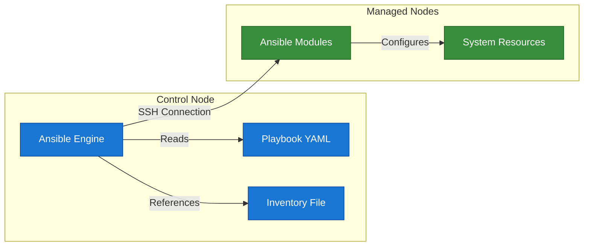

# Cloud1

Automated deployment of a WordPress website on a remote server provided by a cloud provider.

## Infrastructure

Each of this service will have it's container:

<ul>
  <li>
     MySQL
  </li>
  <li>
     PHPmyadmin
  </li>
  <li>
     Nginx
  </li>
  <li>
     WordPress
  </li>
</ul>

Technologies used in this project:

<ul>
  <li>
     Ansible
  </li>
  <li>
     Docker
  </li>
</ul>

## Installation

1. Clone the repository:

   ```bash
   git clone
   ```

2. Navigate to the project directory:

   ```bash
   cd 42_Cloud1
   ```

3. Install the required dependencies:

   - If you are using a virtual environment, activate it first:

     ```bash
     python3 -m venv .venv
     ```

     ```bash
     source .venv/bin/activate
     ```

   - Then install the dependencies using pip:

     ```bash
     pip install -r requirements.txt
     ```

4. Create a `.env` file in the root directory and set the required environment variables:
   ```bash
   cp .env.example .env
   ```


## [Ansible](https://docs.ansible.com/)

Ansible is a powerful open-source automation tool that can be used to deploy and manage applications and services.



Ansible operates on a control node that manages one or more managed nodes. The control node runs the Ansible engine, which reads playbooks and inventories to execute tasks on the managed nodes.

Inventories allow you to define the managed nodes and their connection details. Ansible uses these inventories to know which nodes to target for configuration management.

Playbooks are YAML files that define the tasks to be executed on the managed nodes.
