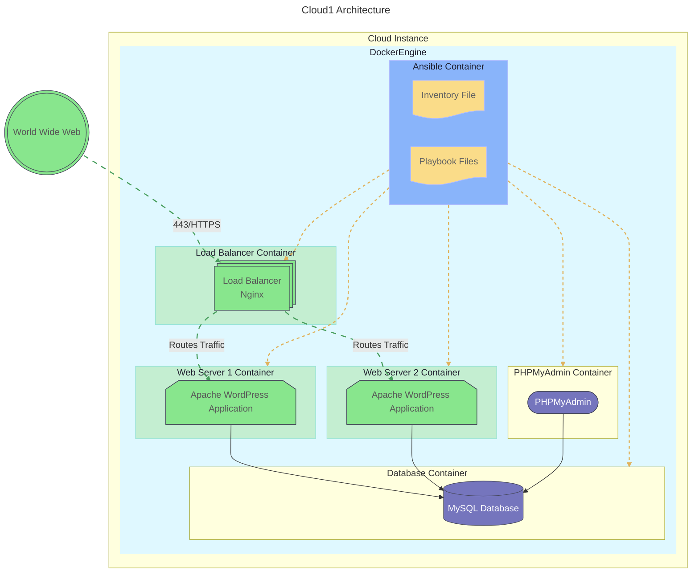
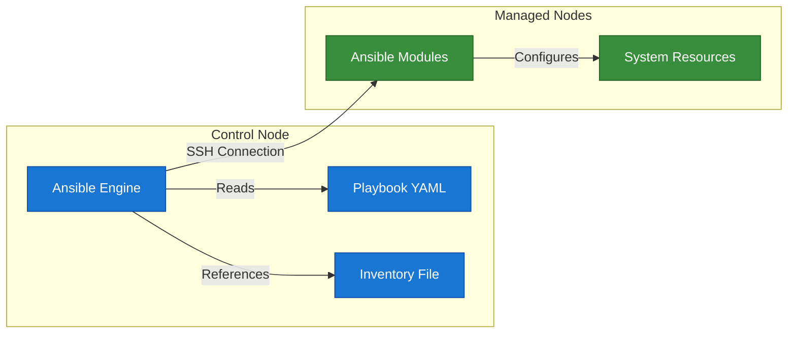

# Cloud1

Automated deployment of a WordPress website on a remote server provided by a cloud provider.

## Infrastructure

Each of this service will have it's container:

<ul>
  <li>
     MySQL
  </li>
  <li>
     PHPmyadmin
  </li>
  <li>
     Nginx
  </li>
  <li>
     WordPress
  </li>
</ul>

Technologies used in this project:

<ul>
  <li>
     Ansible
  </li>
  <li>
     Docker
  </li>
</ul>

## Architecture




## [Ansible](https://docs.ansible.com/)

Ansible is a powerful open-source automation tool that can be used to deploy and manage applications and services.



Ansible operates on a control node that manages one or more managed nodes. The control node runs the Ansible engine, which reads playbooks and inventories to execute tasks on the managed nodes.

### Key Components

- **Ansible Engine**: The core component that executes tasks defined in playbooks.
- **Playbooks**: YAML files that define the tasks to be executed on the managed nodes.
- **Inventory**: A file that lists the managed nodes and their connection details.
- **Ansible Modules**: Reusable scripts that perform specific tasks on the managed nodes.
- **Managed Nodes**: The servers or devices that Ansible manages.

### Inventory and Playbooks

Inventories allow you to define the managed nodes and their connection details. Ansible uses these inventories to know which nodes to target for configuration management.

### Example Inventory

```yaml
all:
  hosts:
    node1:
      ansible_host: node1.example.com
    node2:
      ansible_host: node2.example.com
  vars:
    ansible_user: user
```

Playbooks are YAML files that define the tasks to be executed on the managed nodes.

#### Example Playbook

```yaml
- name: MyFirstPlay
  hosts: all
  tasks:
    - name: Ping all nodes
      ansible.builtin.ping:

    - name: Print message
      ansible.builtin.debug:
        msg: "Hello from {{ inventory_hostname }}"
```
