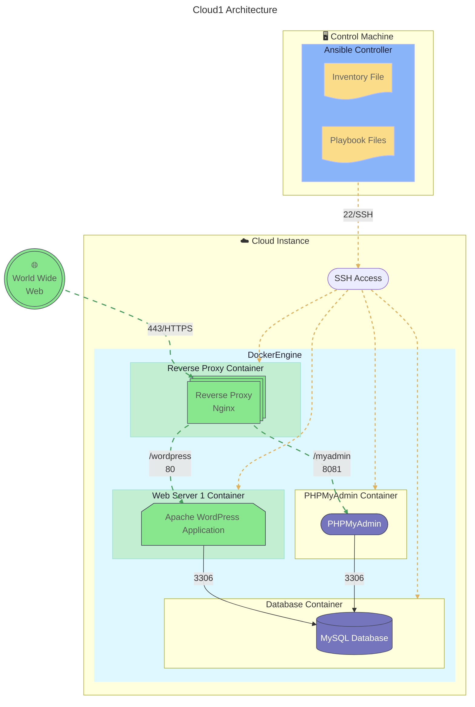
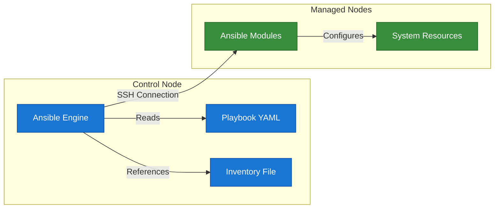

# Cloud1

Automated deployment of a WordPress website on a remote server provided by a cloud provider.

## Infrastructure

Each of this service will have it's container:

<ul>
  <li>
     MySQL
  </li>
  <li>
     PHPmyadmin
  </li>
  <li>
     Nginx
  </li>
  <li>
     WordPress
  </li>
</ul>

Technologies used in this project:

<ul>
  <li>
     Ansible
  </li>
  <li>
     Docker
  </li>
</ul>

## Architecture




## [Ansible](https://docs.ansible.com/)

Ansible is a powerful open-source automation tool that can be used to deploy and manage applications and services.



Ansible operates on a control node that manages one or more managed nodes. The control node runs the Ansible engine, which reads playbooks and inventories to execute tasks on the managed nodes.

### Key Components

- **Ansible Engine**: The core component that executes tasks defined in playbooks.
- **Playbooks**: YAML files that define the tasks to be executed on the managed nodes.
- **Inventory**: A file that lists the managed nodes and their connection details.
- **Ansible Modules**: Reusable scripts that perform specific tasks on the managed nodes.
- **Managed Nodes**: The servers or devices that Ansible manages.

### Inventory and Playbooks

Inventories allow you to define the managed nodes and their connection details. Ansible uses these inventories to know which nodes to target for configuration management.

Roles are a way to organize playbooks and tasks into reusable components. They can be shared and reused across different projects.

#### Example Inventory

```yaml
all:
  hosts:
    node1:
      ansible_host: node1.example.com
    node2:
      ansible_host: node2.example.com
  vars:
    ansible_user: user
```

Playbooks are YAML files that define the tasks to be executed on the managed nodes.

#### Example Playbook

```yaml
- name: MyFirstPlay
  hosts: all
  tasks:
    - name: Ping all nodes
      ansible.builtin.ping:

    - name: Print message
      ansible.builtin.debug:
        msg: "Hello from {{ inventory_hostname }}"
```

Become is used to run tasks with elevated privileges, such as root access. This is often necessary for tasks that require administrative permissions. You can specify the user to become with the `become_user` directive, like so:

```yaml
- name: Install a package with sudo
  ansible.builtin.yum:
    name: httpd
    state: present
  become: true
  become_user: root
```

#### Tags

Tags allow you to run specific parts of a playbook without executing the entire playbook. This is useful for testing or when you only want to apply certain changes.

```yaml
- name: Install a package
  ansible.builtin.yum:
    name: httpd
    state: present
  tags: install

- name: another task
  ansible.builtin.debug:
    msg: "This is another task"
  tags: other
```

When running the playbook, you can specify the tag to execute only that part:

```bash
ansible-playbook playbook.yml --tags install
# Will only run tasks with the 'install' tag, skipping others.
```

#### Roles

[Ansible Roles](https://docs.ansible.com/ansible/latest/playbook_guide/playbooks_reuse_roles.html) are a way to organize playbooks and tasks into reusable components. They allow you to group related tasks, variables, and files together, making it easier to manage complex configurations.

### Templates

Ansible supports Jinja2 templating, allowing you to create dynamic configurations based on variables and facts collected from the managed nodes. This is useful for generating configuration files or scripts that need to be customized for each node.

### Modules

Ansible modules are the building blocks of Ansible tasks. They are reusable scripts that perform specific actions on the managed nodes, such as installing packages, managing files, or executing commands.

[Ansible Docker Compose Module](https://docs.ansible.com/ansible/latest/collections/community/docker/docker_compose_v2_module.html)

### Parallel Execution

Ansible can execute tasks in parallel across multiple managed nodes, making it efficient for large-scale deployments. This is achieved through the use of SSH connections and the ability to run tasks concurrently.

[Ansible Parallelism](https://thelinuxcode.com/ansible-parallelism/)

## Multipass

Multipass is a lightweight VM manager that allows you to create and manage virtual machines easily. It is particularly useful for testing and development environments.

### Usage

To create a new VM with Multipass, you can use the following command:

```bash
multipass launch --name my-vm
```

To list all running VMs, use:

```bash
multipass list
```

To access a specific VM, you can use:

```bash
multipass shell my-vm
```

To delete a VM, use:

```bash
multipass delete my-vm
```
